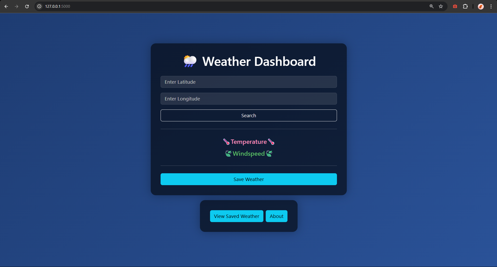

# Weather Dashboard

A simple web application to search, save, and view weather data using the [Open-Meteo API](https://open-meteo.com/), with data storage in MySQL and backend support in both PHP and Flask.

---

# Tech Stack

- Frontend: HTML, CSS, JavaScript, Bootstrap
- Backend: Flask
- Database: MySQL

---

## 🌦️ Features

- Search current weather by latitude and longitude
- Save weather records to a database
- View and delete saved weather records
- Responsive, modern UI (Bootstrap)
- Two backend implementations: PHP (for classic frontend) and Flask (for modern SPA)

---

## 🛠️ Tech Stack

- **Frontend:** HTML, CSS, JavaScript, Bootstrap, Axios
- **Backend:** Python Flask (modern)
- **Database:** MySQL
- **API:** Open-Meteo public API

---

## 🚀 Getting Started

### 1. Clone the Repository

```sh
git clone https://github.com/yourusername/weather-dashboard.git
cd weather-dashboard
```

### 2. Database Setup

1. Open your MySQL client (phpMyAdmin, CLI, etc.).
2. Import the SQL schema:

   ```sql
   SOURCE frontend/db/weather_db.sql;
   ```

   This creates a `weather_app` database and a `weather_data` table.

### 4. Flask Backend Setup

1. Install Python 3 and pip.
2. Install dependencies:

   ```sh
   pip install flask flask-cors mysql-connector-python
   ```

3. Run the Flask app:

   ```sh
   cd flask_app
   python app.py
   ```

4. Access the modern frontend at:  
   [http://localhost:5000/](http://localhost:5000/)

---

## 📂 Project Structure

```
IT111project/
│
├── flask_app/
│   ├── app.py
│   ├── static/js/
│   │   ├── main.js
│   │   └── saved.js
│   └── templates/
│       ├── index.html
│       ├── saved.html
│       └── search.html
│
├── frontend/
│   ├── index.htm
│   ├── saved.htm
│   ├── search.htm
│   ├── backend/
│   │   ├── db.php
│   │   ├── get_saved_weather.php
│   │   ├── save_weather.php
│   │   └── delete_weather.php
│   ├── css/
│   └── db/
│       └── weather_db.sql
│
├── .gitattributes
└── README.md
```

---

## ⚙️ Configuration

- **Database credentials** are set in:
  - [`frontend/backend/db.php`](frontend/backend/db.php)
  - [`flask_app/app.py`](flask_app/app.py) (`db_config` dictionary)

- **API Endpoint:**  
  Uses [Open-Meteo](https://open-meteo.com/) for weather data.

---

## 🖥️ Usage

### Search Weather

1. Enter latitude and longitude.
2. Click "Search" to fetch current weather.

### Save Weather

- After searching, click "Save Weather" to store the result in the database.

### View Saved Weather

- Click "View Saved Weather" to see all saved records.
- You can delete records from this view.

---

## 👥 Team

- Twixt Jasley Tamera
- Kencharviz Alao
- Katrine Angelica Jimenez

---

## 📷 Screenhots



